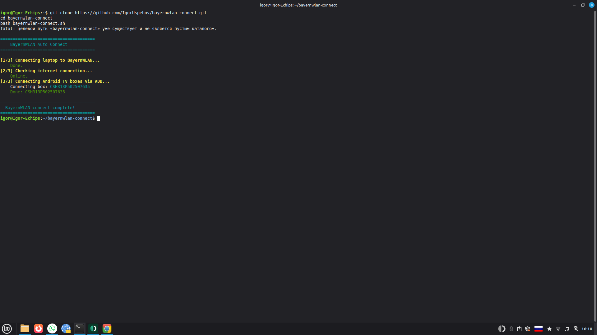

# 🌐 BayernWLAN Auto Connect

A Bash script to automatically connect to BayernWLAN (Munich free WiFi) on your laptop and Android TV boxes via ADB.

## Result



## What it does

- Connects laptop to BayernWLAN via Vodafone captive portal
- Checks internet connection after login
- Automatically connects all Android TV boxes via ADB

## Usage

```bash
git clone https://github.com/IgorUspehov/bayernwlan-connect.git
cd bayernwlan-connect
chmod +x bayernwlan-connect.sh
bash bayernwlan-connect.sh
```

## Desktop shortcut (Linux Mint / Ubuntu)

```bash
cat > ~/Desktop/BayernWLAN.desktop << 'EOF'
[Desktop Entry]
Version=1.0
Type=Application
Name=BayernWLAN Connect
Comment=Connect to Munich free WiFi
Exec=bash -c 'bash "/home/igor/bayernwlan-connect/bayernwlan-connect.sh"; echo ""; echo "Press Enter to close..."; read'
Terminal=true
Icon=network-wireless
Categories=Network;Utility;
EOF
chmod +x ~/Desktop/BayernWLAN.desktop
```

## Requirements

- Debian / Ubuntu / Linux Mint
- `curl` (installed by default)
- `adb` (for TV box support)
- Connected to BayernWLAN WiFi network

## Where BayernWLAN is available in Munich

- Migration office (Ausländerbehörde)
- Job center (Jobcenter)
- Main train station (Hauptbahnhof)
- McDonald's locations
- Many public buildings and supermarkets

## Tested on

- Linux Mint 21.3
- Tanix Android TV Box (Android 10)

## Compatible with

- Debian 11+
- Ubuntu 20.04+
- Linux Mint 20+

## Author

Ihor Kriazhev — [github.com/IgorUspehov](https://github.com/IgorUspehov)
AI-assisted automation | Linux | Android | Python
